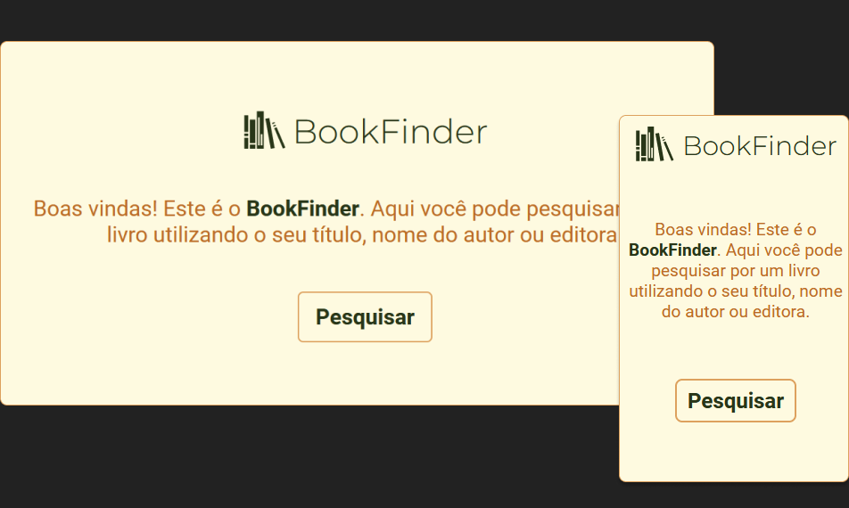

<h1 align="center">  BookFinder</h1>

<p align="center">
  <a href="#-tecnologias">Tecnologias</a>&nbsp;&nbsp;&nbsp;|&nbsp;&nbsp;&nbsp;
  <a href="#-projeto">Projeto</a>&nbsp;&nbsp;&nbsp;|&nbsp;&nbsp;&nbsp;
  <a href="#-layout">Instalação</a>
</p>

<p align="center">
  
</p>

## 🚀 Tecnologias

Esse projeto foi desenvolvido com as seguintes tecnologias:

- React
- TypeScript
- Styled Components
- React Router
- Axios
- Vite

## 💻 Projeto

Neste projeto, o usuário pode pesquisar por um livro utilizando seu título, nome do autor ou editora, e receber informações sobre o livro pesquisado. 
<br>
<br>
Este projeto foi desenvolvido com base no desafio [Book Finder App](https://github.com/florinpop17/app-ideas/blob/master/Projects/2-Intermediate/Book-Finder-App.md), de [florinpop17](https://github.com/florinpop17), e consome a API de livros do Google. O repositório app-ideas tem como propósito trazer diversas ideias de apps para que as pessoas possam praticar e aprimorar seus conhecimentos em programação. 

## Instalação
Para instalar e rodar esta aplicação localmente, é necessário: 
- NodeJS e npm

Siga os passos:

1. Clone este reposotório 
2. Instale as dependências utilizando o comando: 
```
npm install
```
3. Execute o projeto utilizando o comando:
```
npm run dev
```
4. Acesse a aplicação no browser de sua preferência utilizando o link que se encontra no terminal.

